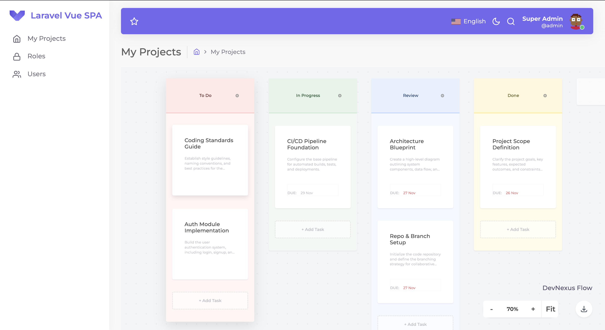

<p align="center">
  
</p>

# Laravel & Vue SPA Starter Kit
[](https://vuejs.org/)
[](https://laravel.com)

[](https://github.com/fumeapp/laranuxt/actions/workflows/lint-php.yml)

# TaskFlow (Laravel & Vue SPA)

\<p align="center"\>
\
\</p\>

[](https://vuejs.org/)
[](https://laravel.com)
[](https://github.com/fumeapp/laranuxt/actions/workflows/lint-php.yml)

TaskFlow is a robust, Dockerized project management tool featuring a unique "Infinite Canvas" interface. Built on top of a solid Laravel & Vue SPA starter kit, this application allows users to manage tasks visually with smooth drag-and-drop capabilities, dynamic styling, and infinite panning/zooming workspaces.

## Key Features

### Infinite Canvas UI

Unlike traditional scrolling boards, TaskFlow implements a Figma-like infinite workspace.

- **Pan & Zoom:** Users can click and drag the empty space to pan around the board.
- **Zoom Controls:** Mouse wheel support and HUD controls for zooming in/out.
- **Fit-to-Screen:** One-click reset to center the view.

\<p align="center"\>
\
\</p\>

### Advanced Task Management

- **Drag & Drop:** Powered by Vue.Draggable (Sortable.js), allowing smooth movement of tasks between columns.
- **Smart Validation:** Due dates are automatically highlighted in red if the task is overdue.
- **Contextual Editing:** Click any card to open a modal for editing or deletion.

### Task Details & Editing

- **Task Details:** Create and edit tasks with Titles, Descriptions (Bios), and Due Dates.
- **Edit Modes:** Seamlessly switch between viewing and editing details within the modal.

### Dynamic Columns & Theming

- **Custom Workflows:** Create, Rename, and Delete columns to fit any workflow.
- **Pastel Color Themes:** New columns are automatically assigned random pastel colors (Pink, Blue, Yellow, Green, Purple) upon creation.
- **Theme Editor:** Users can manually change column colors via the settings icon on the column header.

### Data & Portability

- **Real-time State:** Vuex state management ensures the board UI stays synchronized with the backend.
- **Backup:** Includes a JSON Export feature to download the entire board structure (Columns & Tasks) for backup or migration.

## Technology Stack

- **Backend:** PHP-FPM 8.1, Laravel 10
- **Frontend:** Vue.js 2, Vuex, i18n
- **Drag & Drop:** Vue Draggable / Sortable.js
- **Authentication:** Sanctum (Session based), Fortify
- **Infrastructure:** Docker & Docker Compose, Nginx, MySQL, Redis
- **Testing:** Mailpit (Test mail driver)
- **Queues:** Redis Queues & Task Scheduling

## How it works: Containers

1.  **api**: Serves the backend application (Laravel).
2.  **client**: Serves the frontend application (Vue).
3.  **webserver**: Services static content, storage, and passes traffic to api & client containers (proxy).
4.  **mysql**: Main database connection.
5.  **redis**: Cache driver and queue connection.
6.  **mailpit**: SMTP server with a web interface to view all mails (dev environment).
7.  **worker**: Runs queue workers and crontab.

## API Architecture

TaskFlow uses a RESTful API design. Key endpoints implemented for the Kanban board include:

- **GET** `/api/project/{slug}` - Fetches the full board hierarchy (Project \> Columns \> Tasks).
- **POST** `/api/project/{slug}/columns` - Creates a new column with a random color.
- **PATCH** `/api/project/{slug}/tasks/{task}/move` - A specialized endpoint handling Drag & Drop logic. It manages reordering indices and database transactions to prevent unique constraint collisions during list sorting.
- **PUT** `/api/project/{slug}/tasks/{task}` - Updates task content (Name, Bio, Due Date).

## Installation

### Development Environment

Includes compiling and hot-reloading for development.

```bash
# 1. Setup Environment Variables
cp api/.env.dev.example api/.env.dev

# 2. Build and Start Containers
docker-compose -f docker-compose.yml -f docker-compose.dev.yml up --build

# 3. Run Migrations & Seeds
docker exec -it spa-dev-api-1 php artisan migrate --seed
```

- API Access: http://localhost:8000
- Client Access: http://localhost:3000
- Mailpit Access: http://localhost:8025

### Staging Environment

Compiles and minifies for staging.

```bash
docker-compose -f docker-compose.yml -f docker-compose.stg.yml up --build
```

### Production Environment

Compiles and minifies for production.

```bash
docker-compose -f docker-compose.yml -f docker-compose.prd.yml up --build
```

## Configuration

1.  Vue Env [Configuration Reference](https://cli.vuejs.org/config/).

## Roadmap

- [x] Laravel, Sanctum, and Fortify installations
- [x] Vue & Vuex installations
- [x] Login / Authentication
- [x] Forget & Reset Password
- [x] Update Profile Info & Password
- [x] Roles & Users Module (Permissions)
- [x] **TaskFlow Infinite Board**
- [x] **Task Drag & Drop Implementation**
- [x] **Column Styling & Theming System**
- [x] **JSON Data Export**
- [x] Setup Scheduler, Queue/Workers, Horizon
- [ ] Settings Module
- [ ] Real Time Notifications Module
- [ ] Real Time Chat Module

## Contributing

Contributions are welcome and will be fully credited. Please fork the repository and submit a pull request.